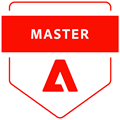

# Certification journey - Adobe Marketo Engage Architect master

Exam ID: AD0-E556

## Start your journey toward certification

Purchase your exam voucher at Adobe Certification Voucher Center. If you have a discount, it will apply at checkout. Apply the voucher code when you schedule your exam.

If an exam is marked as retiring you will see a note at the top of this page. This indicates that you can still take it until the date specified in the note. 

Your certification will be valid for two years from when you pass. We recommend taking the newer version when possible, because it covers newer product capabilities.

If you're a current Marketo Engage Business Practitioner Certified Expert and have:

* At least five years of experience preferably with multiple instances of Marketo Engage
* An understanding of the business impact and effectively explain/communicate their solution to the stakeholders (technical and non-technical) at different levels
* The ability to conceptualize a solution and translate to a Marketo Engage architecture, understand the business processes impacted by integrations
* An understanding of the principles of architecting an instance

Additionally, you're familiar with the following tools and technologies:

* Adobe Marketo Engage features, functionality, and apps
* Database systems
* API connectivity
* CRM platform
* Marketing technology platforms

...this is the certification for YOU!




**Level of experience**: 3-5 years

**Intended audience:**

* Marketing technology manager
* Senior/Marketing operations manager
* Marketing operations director
* Senior Director/Manager for revenue operations
* Marketing operations/technology/automation consultants
* Marketing technologist
* Campaign manager
* Marketing automation manager
* Digital marketing
* Demand generation manager
* Solutions architect
* Business systems analyst
* CRM manager
* CRM/Lifecycle marketing manager

**Exam details - Adobe Marketo Engage Architect**

```

Passing Score: 30/50
Time: 150 mins
Delivery: Online proctored (requires camera access) or test center proctored
Available languages: English
Cost: $225 (global) and $150 (India)
Exam ID: AD0-E556

```

## Get ready

**AD0-E556  Adobe Marketo Engage Architect**

**Exam objectives and scope**

Section 1: Project Leadership (16%)

* Given a case study, identify the right stakeholders
* Evaluate a set of requirements and recommend project boundaries, budget, resources, and scope
* Given a modified process, determine who needs enablement and efficient enablement rollout plan
* Evaluate an audit and recommend priorities and timeline

Section 2: Marketo Engage Architecture Design (48%)

* Gather requirements/needs and recommend a lead management and lifecycle design
* Review an existing implementation and provide findings
* Given a business need, identify the different behaviors for scoring
* Review an existing implementation, recommend actions to scale campaign execution
* Outline an operational procedure for lead routing multiple countries
* Given a scenario, evaluate the impact and requirements to incorporate new technology to the instance
* Identify the different types of integrations and when to use them
* Given a scenario, outline various stages in the person lifecycle impacted by proposed changes/requirements
* Appraise a set of requirements and recommend an approach to campaign logic

Section 3: Reporting and Attribution (20%)

* Given a model to review, explain the concept of detours in the lifecycle modeler
* Given an online advertising or organic social or content, recommend an approach for reporting
* Illustrate how to validate Marketo Engage reporting in tracking lifecycle changes
* Identify metrics to use in a given report type
* Identify how to track multi-channel attribution to evaluate ROI
* Identify and describe the pros and cons of different attribution models
* Given a business requirement, describe the effects of channel set up to reporting

Section 4: Advanced Operations (16%)

* Given a scenario, identify appropriate steps to improve management or governance
* Given a set of requirements, recommend an efficient data schema
* Evaluate a customer's implementation and recommend actions to improve deliverability
* Evaluate a customer's implementation and recommend actions to improve administration management
* Gather information about a client's implementation and recommend security practices
* Explain the applicability of workspace and partitions for a given scenario

## Readiness self assessment

Complete the [online readiness questionnaire](https://scorpion.caveon.com/launchpad/ad-q-e556-readiness-questionnaire-for-adobe-marketo-engage-architect-master-exam/ad-q-e556-readiness-questionnaire-for-adobe-marketo-engage-architect-master-exam){target="_blank"} to see if your current experience matches the recommended minimum candidate qualification.

## Get prepped

You are not required to complete training before taking the exam, and training alone will not provide you with the knowledge and skills required to pass the exam. A combination of training and successful, on-the-job experience are critical to providing you with the repository needed to pass the exam.

Here are some suggested resources to help you prepare:

**AD0-E556 Adobe Marketo Engage Architect**

**Section 1: Project Leadership**

* [Champion Blog - Marketo Nation](https://nation.marketo.com/t5/champion-blog/ct-p/champion-program){target="_blank"}
* [Marketo Product Docs](https://experienceleague.adobe.com/docs/marketo/using/home.html?lang=en){target="_blank"}
* [Documentation - REST API](https://developers.marketo.com/rest-api/){target="_blank"}

**Section 2: Adobe Marketo Engage Architecture Design**

* [Instructions for Creating a Custom Sync Rule](https://nation.marketo.com/t5/product-blogs/instructions-for-creating-a-custom-sync-rule/ba-p/242758#:~:text=First%2C%20what%20is%20a%20custom,have%20them%20sync%20to%20Marketo.){target="_blank"}
* [The Definitive Guide to Lead Scoring](https://business.adobe.com/resources/guides/lead-scoring.html){target="_blank"}

**Section 3: Reporting and Attribution**

* [Marketo Product Docs](https://experienceleague.adobe.com/docs/marketo/using/home.html?lang=en){target="_blank"}
* [Champion Blog - Marketo Nation](https://nation.marketo.com/t5/champion-blog/ct-p/champion-program){target="_blank"}

**Section 4: Advanced Operations**

* [Marketo Product Docs](https://experienceleague.adobe.com/docs/marketo/using/home.html?lang=en){target="_blank"}
* [Suppressing Soft Bounces](https://nation.marketo.com/t5/product-discussions/suppressing-soft-bounces-any-email-min-3x-encouraged/m-p/209411#M153533){target="_blank"}
* [Understanding Workspaces and Person Partitions](https://experienceleague.adobe.com/docs/marketo/using/product-docs/administration/workspaces-and-person-partitions/understanding-workspaces-and-person-partitions.html?lang=en){target="_blank"}

## Sample questions

The sample questions allow you to see the type and format of items that you will encounter in the actual exam. There is no sign-on needed. The results of the sample questions are not stored, and do not predict your actual test results.

[See sample questions](https://scorpion.caveon.com/launchpad/ad0-e556-adobe-marketo-engage-architect-master-exam-copy-pewwl4){target="_blank"}

* Provide your email address.
* Answer the candidate agreement.
* Start the test.
* Mark your answer in each question.
* Click Next on the upper portion of the screen to save your answer and move to the next question. You may return and revise your question within the specified time.
* On the last question, click Submit Exam to submit all your answers.
* Answer the short survey.

## Get certified

To schedule your exam you will click on "schedule" below. This will redirect you to the Adobe Credential Management system where you will click scheduling>then search for this exam to schedule.

[Schedule AD0-E556](https://learning.adobe.com/api.certify.json){target="_blank"}

## Questions

Have a question about Adobe Certification? Please email `certif@adobe.com`.

View the certification [FAQs](https://solutionpartners.adobe.com/solution-partners/training_and_certification/certification/certification_faq.html#){target="_blank"}.