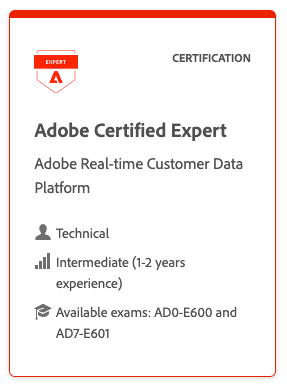

# Adobe Real-Time Customer Data Platform Certification {#rtcdp-certification}

 {width="129" height="129" align="center"}

 <strong>Technical Practitioners </strong> 

You have technical knowledge about audience segmentation, destination exports, and activation on real time basis for unified profiles that adhere to data and privacy regulations, customer data platforms (CDP) and knowledge of Adobe Experience Platform.

 &nbsp;
 &nbsp;

<table>

<tr>
  <td>

  

  </td>
  <td>

  ## Follow these steps to earn a new credential

  ### 1. Read the exam guides

  To earn the Real-time Customer Data Platform certification, you must also pass the Experience Platform Technical Foundations exam. Read the exam guides to learn:

  * Minimum level of job experience, knowledge, skills, and abilities required to pass the exam for this role
  * Topics and question distribution: understand the key skills and domains you should know before attempting the exam and learn the percentage of questions per domain.
  * How to register, the number of questions, time limit, passing score, and test delivery

  <table>
    <tr style="border: 0;">
    <td style="width: 160px;">
      <a href="https://express.adobe.com/page/sBkhdT10gy2sx/" target="_blank" class="spectrum-Button spectrum-Button--outline spectrum-Button--primary spectrum-Button--sizeM">Exam prep guide</a>
    </td>
    <td style="width: 215px;">
      <a href="https://express.adobe.com/page/GpJxl9cwvjjtK/" target="_blank" class="spectrum-Button spectrum-Button--outline spectrum-Button--primary spectrum-Button--sizeM">Read the guide: AD0-E600</a>
    </td>
    <td>
      <a href="https://express.adobe.com/page/biBbuOvvUDEy2/" target="_blank" class="spectrum-Button spectrum-Button--outline spectrum-Button--primary spectrum-Button--sizeM">Read the guide: AD7-E601</a>
    </td>
    </tr>
  </table>  

  </td>
</tr>

<tr>
  <td></td>
  <td>

  ### 2. Begin training and get job experience

  Learner journeys provide the recommended steps to earn credentials. You have free access to hundreds of courses and self-paced learning modules, videos, quizzes, and test outs.

  You can also register to join an instructor-led class with Adobe trainers. Bronze and above partners can request a 15-30 percent discount from SPP Help. <a href="https://learning.adobe.com/catalog.html?solution=Adobe%20Experience%20Platform">View catalog</a>.

<table>
<tr>
<td>
  **Training**

  Training is not required before taking the exam, but it is recommended.

  <a href="https://solutionpartners.adobe.com/solution-partners/home/applications/experience_cloud/real_time_cdp/training/technical.html?nav=credential#navigation">Complete training</a>
</td>
<td>
  **Practice and experience**

  Many partners have study groups and mentoring to help employees gain experience.

  <a href="https://solutionpartners.adobe.com/solution-partners/home/learn/credentials/certification/partner_mentorship.html" target="_blank" class="spectrum-Button spectrum-Button--outline spectrum-Button--primary spectrum-Button--sizeM">Go to mentorship program</a>
</td>
</tr>
</table>

  </td>
</tr>

<tr>
<td></td>
<td>

### 3. Take the exam

To earn certification, you need to pass 2 distinct exams with a proctor present, online or on-site, where available.

Purchase your exam voucher at <a href="https://market.xvoucher.com/adobe">Adobe Certification Voucher Center</a>, which will apply your partner discount at checkout. Apply the voucher code when you schedule your exam.

If an exam is marked as Retiring, you can still take it and your certification will be valid for two years from when you pass. We recommend taking the newer version, when possible, because it covers newer product capabilities. .

<table>
<tr>
  <td>
  <strong>Adobe Experience Platform</strong>

  <em>Technical Practitioner

  Adobe Certified Expert
  Exam ID: AD0-E600</em>
  </td>
  <td>
  Duration: 105 min

  Delivery: Online or at a test center

  <a href="https://solutionpartners.adobe.com/solution-partners/home/learn/credentials/certification/certification_exam_registration_and_management.html?nav=cost">See costs and discounts</a>

  <a href="https://www.certmetrics.com/adobe/" target="_blank" class="spectrum-Button spectrum-Button--fill spectrum-Button--accent spectrum-Button--sizeM is-margin-bottom-big-big at-element-click-tracking" style="background-color:#1473E6">
  Schedule an exam</a>
  </td>
</tr>
</table>

AND

<table>
<tr>
   <td>
   <strong>Adobe Real-time Customer Data Platform</strong>

   <em>Technical Practitioner

   Adobe Certified Expert
   Exam ID: AD7-E601</em>
   </td>
   <td>
   Duration: 51 min

   Delivery: Online or at a test center

   <a href="https://solutionpartners.adobe.com/solution-partners/home/learn/credentials/certification/certification_exam_registration_and_management.html?nav=cost">See costs and discounts</a>

   <a href="https://www.certmetrics.com/adobe/" target="_blank" class="spectrum-Button spectrum-Button--fill spectrum-Button--accent spectrum-Button--sizeM is-margin-bottom-big-big at-element-click-tracking" style="background-color:#1473E6">
   Schedule an exam</a>
   </td>
</tr>
</table>

View the [certification](https://solutionpartners.adobe.com/solution-partners/home/support/faq/certification_credentials.html) FAQ if you have any questions about credentials, prepaid vouchers, discounts, and bulk orders.
</td>
</tr>

<tr>
<td></td>
<td>

### 4. Get your badge

Once you earn a credential you can download your digital badge. You can use your badge on social profiles and verify your achievement to your employer and customers that you are skilled in this application.

<a href="https://www.credly.com/organizations/adobe/badges" target="_blank" class="spectrum-Button spectrum-Button--outline spectrum-Button--primary spectrum-Button--sizeM">Get badge</a>

## Renew this certification

Adobe certifications expire after two years. Take the shorter, lower-cost renewal exam that demonstrates your knowledge of newer capabilities and commitment to keeping your skills current.

At this time there is no renewal certification exam available. See the  <a href="https://solutionpartners.adobe.com/solution-partners/home/learn/credentials/credential_journeys.html"> full list of credentials </a>here.
</td>
</tr>