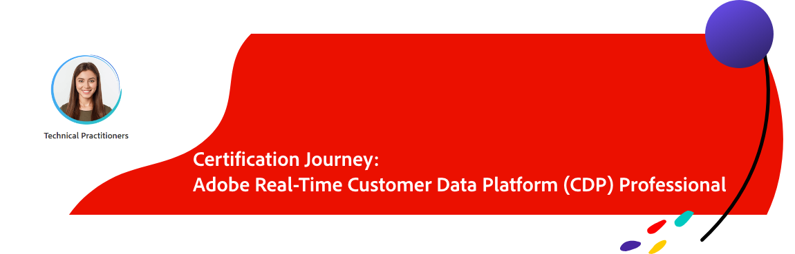

# Adobe Real-Time Customer Data Platform Certification {#rtcdp-certification}

 &nbsp;

<table>
<tr  style="border: 0;">
<td style="width: 160px;text-align: right;">
  
</td>
<td style="width: 400px;">
  <strong>Level of Experience : 1-3 years</strong>

  <strong>Requirement</strong>
  You must pass Adobe Experience Platform Foundations <a href="https://experienceleague.corp.adobe.com/docs/certification/certification/hidden/ad0-e600.html" target="_blank">Ad0-E600</a> to achieve this certification.</em>

  <strong>Intended audience</strong>
  Data Architect/Engineer, Solution Architect or MSA, 
  Enterprise Architect, Product Manager, Marketing Technology Lead

  <strong>Exam Details</strong>
  Passing Score: 25/34
  Time: 51 mins
  Cost: $225 (global) and $150 (India)
  Exam ID: AD7-E601
</td>
</tr>
</table>  

 &nbsp;

If you have technical knowledge about audience segmentation, destination exports, 
and activation on real time basis for unified profiles that adhere to data and privacy regulations, 
customer data platforms (CDP) and knowledge of Adobe Experience Platform. 
This is the certification for YOU!

Ready...Set...Get Certified!

 &nbsp;

<table>
<tr style="border: 0;">
 <td>

   **Get Ready!**

  Review exam topics, understand the minimum qualified candidate, and take a readiness questionnaire.

   <a href="https://solutionpartners.adobe.com/solution-partners/home/applications/experience_cloud/real_time_cdp/training/technical.html?nav=credential#navigation" target="_blank" class="spectrum-Button spectrum-Button--outline spectrum-Button--primary spectrum-Button--sizeM">Get Ready</a>

 </td>
  <td>

   **Get Set!**

   Take advantage of our free resources to get set for your certification exam.

   <a href="https://solutionpartners.adobe.com/solution-partners/home/applications/experience_cloud/real_time_cdp/training/technical.html?nav=credential#navigation" target="_blank" class="spectrum-Button spectrum-Button--outline spectrum-Button--primary spectrum-Button--sizeM">Get Set</a>

 </td>
  <td>

   **Get Certified!**

   Take the next step...get certified TODAY!

   <a href="https://solutionpartners.adobe.com/solution-partners/home/applications/experience_cloud/real_time_cdp/training/technical.html?nav=credential#navigation" target="_blank" class="spectrum-Button spectrum-Button--outline spectrum-Button--primary spectrum-Button--sizeM">Get Certified</a>

 </td>
</tr>
<tr style="border: 0;">
<td>
   <a href="https://solutionpartners.adobe.com/solution-partners/home/applications/experience_cloud/real_time_cdp/training/technical.html?nav=credential#navigation" target="_blank" class="spectrum-Button spectrum-Button--outline spectrum-Button--primary spectrum-Button--sizeM">Get Ready</a>
</td>
<td>
   <a href="https://solutionpartners.adobe.com/solution-partners/home/applications/experience_cloud/real_time_cdp/training/technical.html?nav=credential#navigation" target="_blank" class="spectrum-Button spectrum-Button--outline spectrum-Button--primary spectrum-Button--sizeM">Get Set</a>
</td>
<td>
   <a href="https://solutionpartners.adobe.com/solution-partners/home/applications/experience_cloud/real_time_cdp/training/technical.html?nav=credential#navigation" target="_blank" class="spectrum-Button spectrum-Button--outline spectrum-Button--primary spectrum-Button--sizeM">Get Certified</a>
</td>
</tr>
</table>

