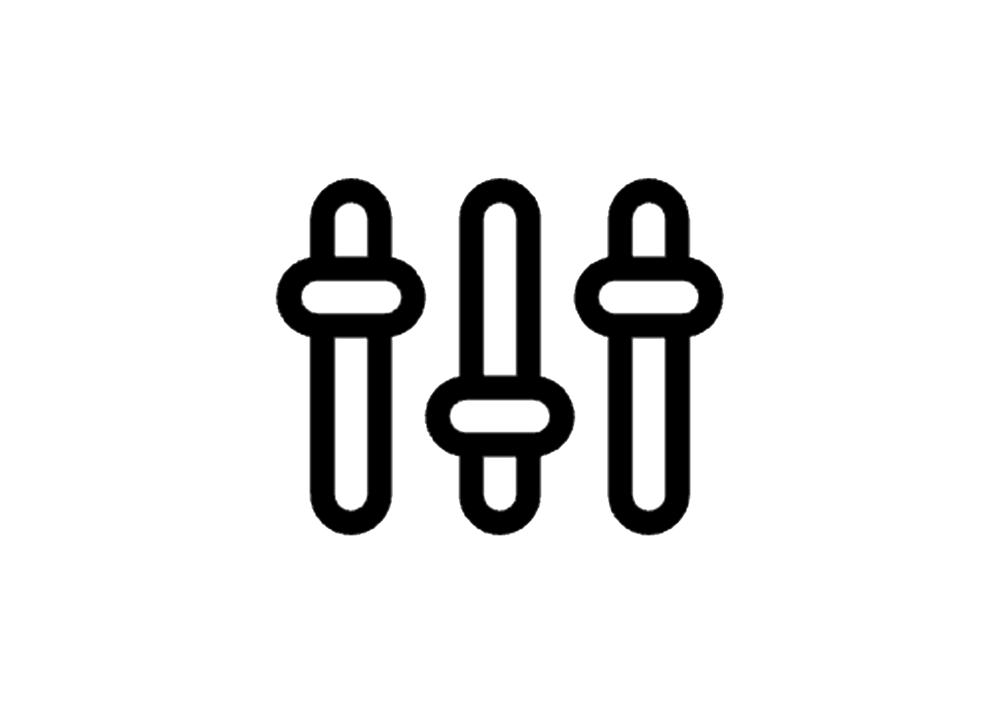

# Certification overview {#certification-overview}

<table>
<tr style="border: 0">
  <td>
    
    

      <strong>Role</strong>
    

    

    <em>Find your certification options based on the role you play in your organization.</em>
    

    <a href="https://solutionpartners.adobe.com/solution-partners/training_and_certification/certification.html#" class="spectrum-Button spectrum-Button--outline spectrum-Button--primary spectrum-Button--sizeM">
      Get Started
    </a>
  </td>
  <td>
    
    

      <strong>Solution</strong>
    

    

    <em>Find your certification options based on the Adobe solutions you use.</em>
    

    <a href="https://solutionpartners.adobe.com/solution-partners/training_and_certification/certification.html#" class="spectrum-Button spectrum-Button--outline spectrum-Button--primary spectrum-Button--sizeM">
      Get Started
    </a>
  </td>
  <td>
    
    

      <strong>Level</strong>
    

    

    <em>Find your certification options based on your skill experience with Adobe's solutions.</em>
    

    <a href="https://solutionpartners.adobe.com/solution-partners/training_and_certification/certification.html#" class="spectrum-Button spectrum-Button--outline spectrum-Button--primary spectrum-Button--sizeM">
      Get Started
    </a>
  </td>  
</tr>
</table>

## What's New

Spicy jalapeno bacon ipsum dolor amet ground round chuck landjaeger fatback. Meatball chislic pork, sirloin burgdoggen chicken short ribs doner corned beef pancetta. Meatball shoulder t-bone pastrami shankle chislic kevin burgdoggen. Shankle filet mignon ham cupim prosciutto pig. Flank chicken drumstick, cow leberkas short loin picanha.

## Why get certified

Spicy jalapeno bacon ipsum dolor amet ground round chuck landjaeger fatback. Meatball chislic pork, sirloin burgdoggen chicken short ribs doner corned beef pancetta. Meatball shoulder t-bone pastrami shankle chislic kevin burgdoggen. Shankle filet mignon ham cupim prosciutto pig. Flank chicken drumstick, cow leberkas short loin picanha.

## Available resources

Spicy jalapeno bacon ipsum dolor amet ground round chuck landjaeger fatback. Meatball chislic pork, sirloin burgdoggen chicken short ribs doner corned beef pancetta. Meatball shoulder t-bone pastrami shankle chislic kevin burgdoggen. Shankle filet mignon ham cupim prosciutto pig. Flank chicken drumstick, cow leberkas short loin picanha.

## Program Framework

Spicy jalapeno bacon ipsum dolor amet ground round chuck landjaeger fatback. Meatball chislic pork, sirloin burgdoggen chicken short ribs doner corned beef pancetta. Meatball shoulder t-bone pastrami shankle chislic kevin burgdoggen. Shankle filet mignon ham cupim prosciutto pig. Flank chicken drumstick, cow leberkas short loin picanha.

## Testimonials

Spicy jalapeno bacon ipsum dolor amet ground round chuck landjaeger fatback. Meatball chislic pork, sirloin burgdoggen chicken short ribs doner corned beef pancetta. Meatball shoulder t-bone pastrami shankle chislic kevin burgdoggen. Shankle filet mignon ham cupim prosciutto pig. Flank chicken drumstick, cow leberkas short loin picanha.

<!--
This is the landing page of the user guide. It should be the first list item in the TOC.md file.

See other user landing pages to get ideas.
-->
